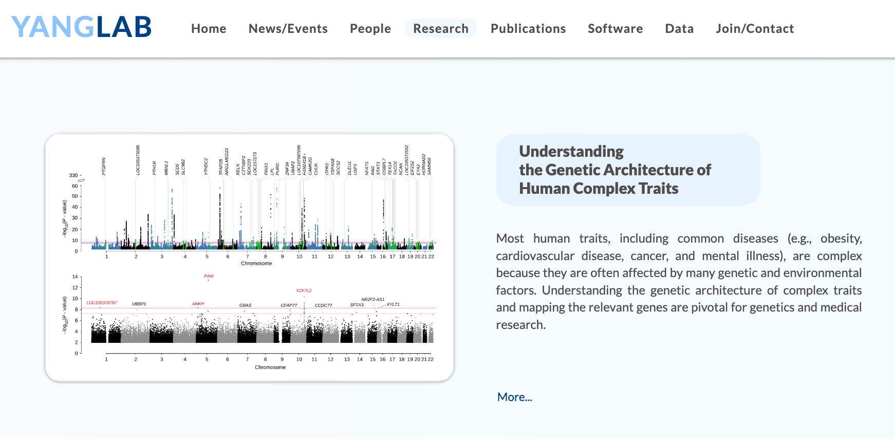

Cite `dNdS-Fun`
-------------------

Contact
-------------------
If you have any question, please send an email to Mengyue Zheng at zhengmengyue@westlake.edu.cn or Junren Hou at houjunren@westlake.edu.cn or Jian Yang at jian.yang@westlake.edu.cn.

Our group
-------------------
[YangLab](https://yanglab.westlake.edu.cn/)

Parameters of `dNdS-Fun`
-------------------
- `mutsFile`: The input table of somatic mutations is a table-delimited text file. Each row corresponds to a somatic mutation, and six columns are separate "IndividualID, Chromosome, Position, Ref, Alt, Functional_impact_scores (raw score)". (Attention: The IndividualID is needed be provided to filtered out the duplicate mutations from the same indivudual. If you have not exact IndividualID for the recurrent mutations, you can use different pseudo-IndividualID to avoid the filteration of recurrent mutations from different individuals.)
- `refDb_element`: The trinucleotide models hava been constructed, including coding region (cds-exon), proximatory regions of splicing site (ss), 5'UTR (5utr), 3'UTR (3utr), promoter (prom), intron (intron-gencode) and intergenic (intergenic-gencode) regions.
- `reg`: A character variable to specify the corresponding constructed models, including coding region (cds-exon), proximatory regions of splicing site (ss), 5'UTR (5utr), 3'UTR (3utr), promoter (prom), intron (intron-gencode) and intergenic (intergenic-gencode) regions. Please use the values in parentheses for assignment.
- `globaldnds_outFile`: The output of global selection estimation.
(revised) - `genelevel_selcv_outFile`:
- `genelevel_outFile`: The output of gene/element-level selection estimation.
- `iscv`: The covariates parameter. The default is NULL. This parameter is designed to use covariates to reduce the uncertainty in the variation of the mutation rate across genes. However, current no covariates is currently suitable for the dNdS-Fun model. We only kept the NULL parameter until it's available.
- `score`: A bool variable for informing software whether the input mutsFile  needs to add a column named "score". This field means functional impact score for somatic mutation. Default is false (We suppose your mutsFile includes this column). If this field is missing, please set it as "true", then this parameter should be combined with the parameter "score database" (showing below).
- `score_database`: This database is used to obtain the score value for mutsFile when "socre" column is missing. If your "score" parameter is set as true, please download the [data](https://jianyanglab.github.io/dNdS-Fun/documentation/03_data.html) for input.
- `model`: A numeric variable to determine whether the gene/element-level analysis could be conducted. If the variable equal to 1, it only estimate the global selection, or it would estimate the global and gene/element-level selection.

Credits and Acknowledgements
-------------------
Mengyue Zheng (methods, data analysis and documentation), Junren Hou (online tool and maintenance), Wei Xi (overseeing, methods, documentation, and maintenance) and Jian Yang (overseeing, methods, documentation, and maintenance). We thank the Westlake University High Performance Computing Centre for hosting the online tool and the summary data.

