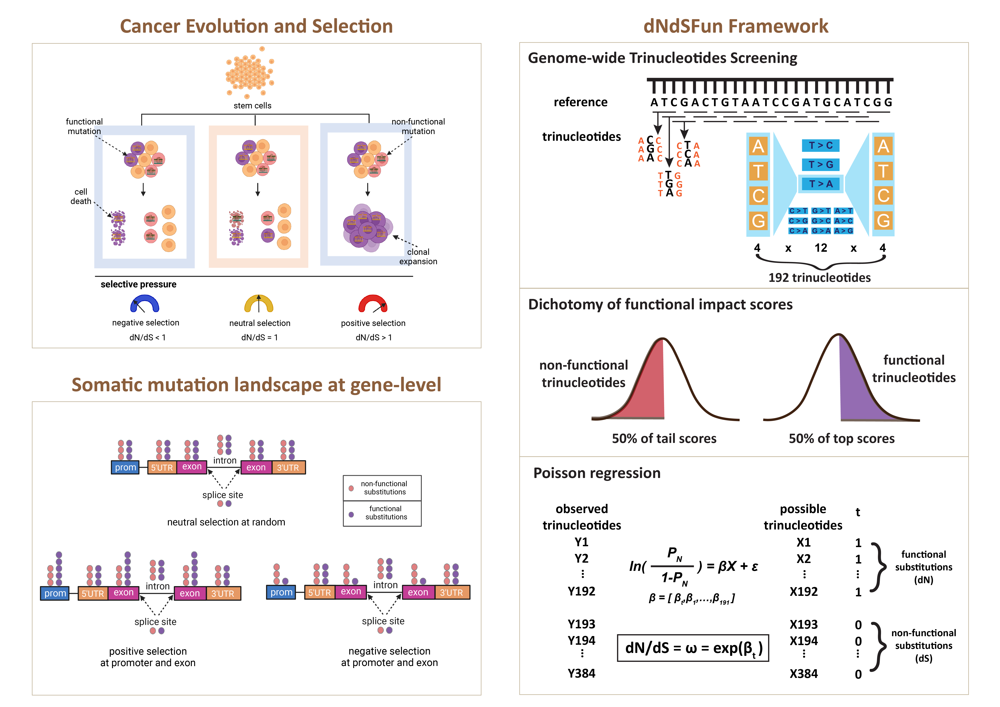

# dNdS-Fun
### dNdS-Fun: a tool for detecting selection signatures of both coding and noncoding somatic mutations in cancer genomes
**dNdS-Fun** is a generalized framework that extends the classical dN/dS methodology, specifically dNdScv, to detect and quantify selection signatures on both coding and noncoding somatic mutations in cancer genomes. By integrating genome-wide functional impact scores, dNdS-Fun allows for the identification of positive and negative selection of both coding and noncoding mutations at global (genome-wide) and local (gene or element-specific) scales.

### Key Features
<!-- dNdS-Fun is a genome-wide `selection` detection algorithm, integrating established genome-wide functional impact scores into the conventional dN/dS framework for cancer genome study. dNdS-Fun significantly improves our understanding of selection in noncoding regions of cancer genomes, which account for more 98.5% of the genome than coding sequences. Similar to synonymous sites in dN/dS, dNdS-Fun define variants at the bottom 50% functional impact scores in whole genome, most of which are assumed selectively neutral, as nonfunctional class of sites to control background mutation rates; as nonsynonymous sites, other variants at the top 50% functional impact scores are defined as functional class of sites. Then, selection can be quantified as the ratio between the probability of a mutation occurring at either class of sites. To correct context-dependent effects of mutations, we also fit all 192 trinucleotide mutational types (all possible combinations for one base upstream and downstream from the mutant base in either transcribed or non-transcribed strand) in the model as previously described. 
-->

- **Functional Impact Scores Integration:** Utilizes genome-wide functional impact scores (e.g., CADD) to assess the potential functional importance of mutations across the entire genome.
- **Mutation Grouping:** Classifies genomic sites into two groups based on functional impact scores:
- - **More Functional Group:** Sites with higher functional impact scores (analogous to nonsynonymous mutations).
- - **Less Functional Group:** Sites with lower functional impact scores (analogous to synonymous mutations).
- **Selection Metric (ω):** the normalized ratio of observed mutations in the more functional group to the less functional group, adjusted for the number of possible sites and mutation rates. The ω ratio indicates the direction of selection and quantifies selection strength:
**ω > 1:** Indicates positive selection.
**ω < 1:** Indicates negative selection.
**ω = 1:** Indicates no evidence of selection.
- **Trinucleotide Context Correction:** Following dNdScv, accounts for sequence context-dependent mutation rates by modelling mutations within a 192 trinucleotide framework (considering all possible substitutions in the context of one upstream and one downstream base).
- **Global and Local Analysis:**
**Global Analysis:** Estimates ω within a functional category (e.g., coding sequences, promoters, splice sites, UTRs, introns, intergenic regions) across the entire genome.
 **Local Analysis:** Estimates ω for individual genes or genomic elements, allowing for fine-scale detection of selection signatures.

### Installations
* [here](https://jianyanglab.github.io/dNdS-Fun/documentation/02_installation.html)

<!-- ### Example analysis
* [Example](https://jianyanglab.github.io/dNdS-Fun/documentation/04_Example.html) -->

